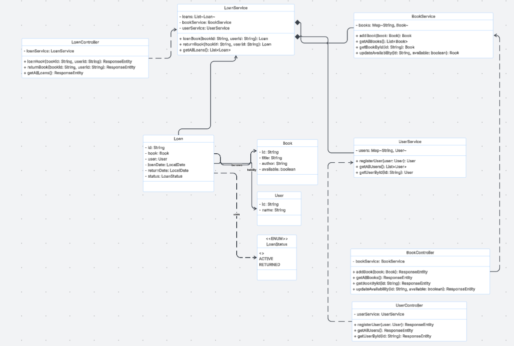
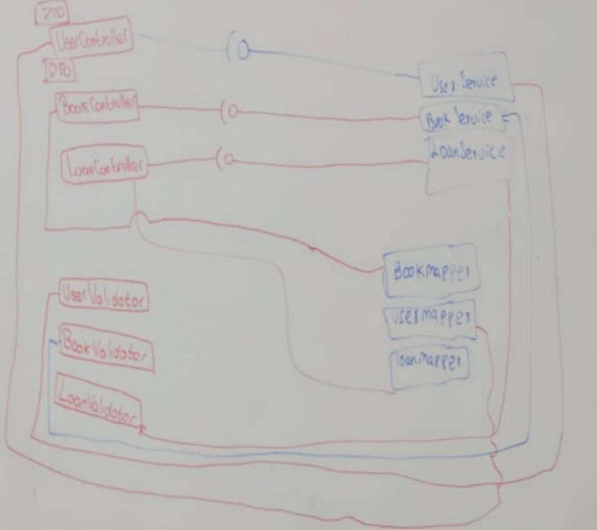
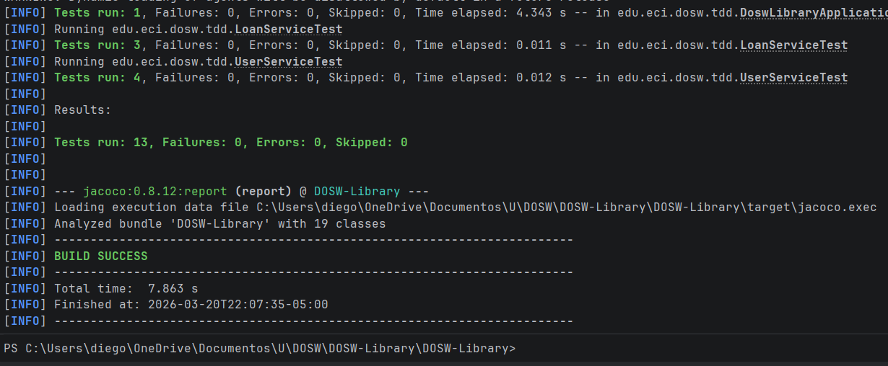
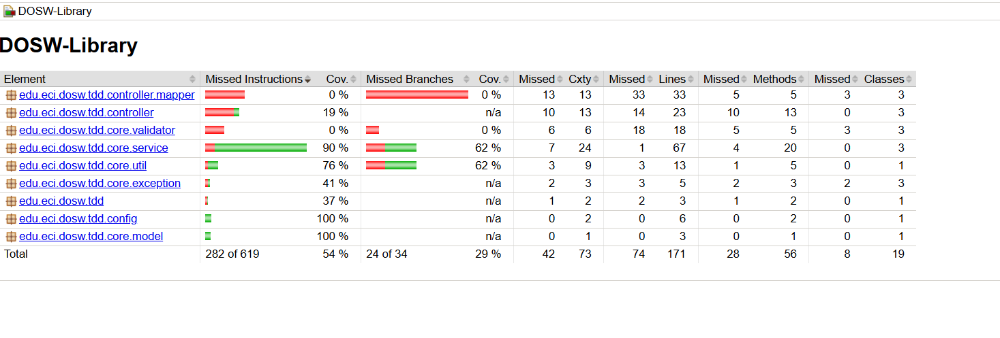
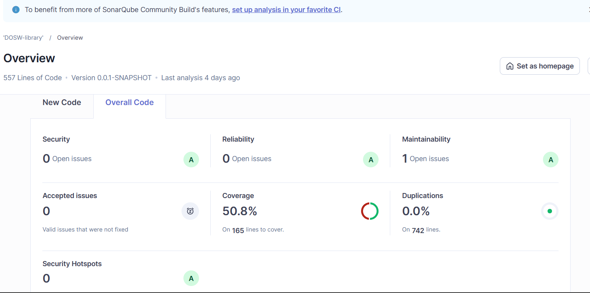

# DOSW Library API

Sistema de gestión de biblioteca desarrollado con **Spring Boot 3** y **Java 21**, aplicando metodología **TDD** (Test-Driven Development).

---

## 🏗Arquitectura del proyecto

```
src/
├── controller/          # Endpoints REST (BookController, LoanController, UserController)
│   ├── dto/             # Data Transfer Objects
│   └── mapper/          # Conversión Model ↔ DTO
└── core/
    ├── model/           # Entidades del dominio (Book, User, Loan)
    ├── service/         # Lógica de negocio
    ├── exception/       # Excepciones personalizadas
    ├── validator/       # Validaciones de entrada
    └── util/            # Utilidades
```

---

## Diagramas

### Diagrama de Clases




### Diagrama de Arquitectura de Capas



```

```

---

## Cómo correr el proyecto

### Prerrequisitos

- Java 21
- Maven 3.9+

### Ejecutar la aplicación

```bash
mvn spring-boot:run
```

La API queda disponible en: `http://localhost:8080`

Swagger UI: `http://localhost:8080/swagger-ui/index.html`

---

##  Ejecución de la API

### Endpoints disponibles

| Método | Endpoint | Descripción |
|--------|----------|-------------|
| `POST` | `/api/users` | Registrar usuario |
| `GET` | `/api/users` | Listar usuarios |
| `GET` | `/api/users/{id}` | Buscar usuario por ID |
| `POST` | `/api/books` | Agregar libro |
| `GET` | `/api/books` | Listar libros |
| `GET` | `/api/books/{id}` | Buscar libro por ID |
| `PATCH` | `/api/books/{id}/availability` | Cambiar disponibilidad |
| `POST` | `/api/loans` | Crear préstamo |
| `PATCH` | `/api/loans/return` | Devolver libro |
| `GET` | `/api/loans` | Listar préstamos |

### Pruebas en Swagger

Video: https://youtu.be/h9VBzvBfrC0?si=zQ4urwWqBdApHR01

##  Ejecución de pruebas

### Correr los tests

```bash
mvn test
```

### Pruebas implementadas

#### `BookServiceTest`

| Test | Descripción |
|------|-------------|
| `addBook_success` | Verifica que un libro se agrega correctamente |
| `addBook_error_whenNullBook` | Verifica que lanza `IllegalArgumentException` con libro null |
| `getBookById_success_whenExists` | Verifica búsqueda exitosa por ID |
| `updateAvailability_success` | Verifica cambio de disponibilidad |
| `updateAvailability_error_whenBookNotFound` | Verifica excepción cuando el libro no existe |

#### `UserServiceTest`

| Test | Descripción |
|------|-------------|
| `registerUserSuccess` | Verifica registro exitoso de usuario |
| `registerUser_error_whenNullUser` | Verifica excepción con usuario null |
| `getUserById_success_whenExists` | Verifica búsqueda exitosa por ID |
| `getUserById_error_whenBlankId` | Verifica excepción con ID vacío |

#### `LoanServiceTest`

| Test | Descripción |
|------|-------------|
| `loanBook_success_marksBookUnavailable_andCreatesActiveLoan` | Verifica préstamo exitoso y que el libro queda no disponible |
| `loanBook_error_whenBookNotAvailable_throwsBookNoAvaliableException` | Verifica excepción cuando el libro no está disponible |
| `returnBook_success_setsReturnedStatus_andMakesBookAvailableAgain` | Verifica devolución y que el libro vuelve a estar disponible |

### Resultado de las pruebas



---

##  Cobertura de código — JaCoCo

### Generar el reporte

```bash
mvn test
```

El reporte queda en: `target/site/jacoco/index.html`

### Resultado de cobertura


---

##  Análisis estático — SonarCloud

### Ejecutar el análisis

```bash
mvn sonar:sonar -Dsonar.token=TU_TOKEN_AQUI
```

El dashboard queda disponible en: `https://sonarcloud.io/organizations/camilo22prog`

### Resultado del análisis


---

## 🛠 Tecnologías usadas

- **Java 21**
- **Spring Boot 3.5**
- **Lombok**
- **JUnit 5**
- **JaCoCo** — cobertura de código
- **SonarCloud** — análisis estático
- **SpringDoc OpenAPI** — documentación Swagger

---

##  Autor

Desarrollado por **Diego** — Escuela Colombiana de Ingeniería Julio Garavito  
Curso: DOSW — Diseño y Construcción de Software